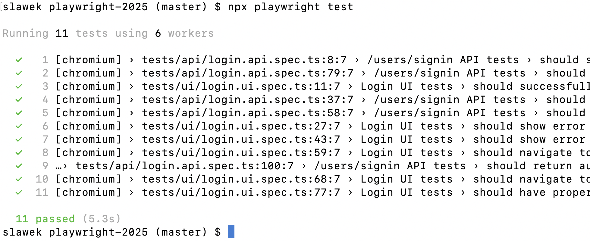

Poniżej znajdziecie organizacyjne informacje oraz aktualną instrukcję przygotowania środowiska na szkolenie.
Proszę o sumienne przygotowanie. Jeśli pojawią się trudności techniczne, niczym się nie martwcie.
Wszystkie problemy rozwiążemy wspólnie na szkoleniu.
Można też skontaktować się ze mną wcześniej mailowo:
[slawomir.radzyminski@gmail.com](mailto:slawomir.radzyminski@gmail.com)

Zalecam pracę na komputerze prywatnym, ze względu na częste ograniczenia bezpieczeństwa na komputerach służbowych.
Prywatny komputer z pełnymi uprawnieniami administratora daje większą elastyczność w rozwiązywaniu problemów.

# Ogólne podejście do szkolenia

Poza teorią podczas szkolenia będziemy pracować na projekcie:

- [https://github.com/slawekradzyminski/playwright-2025](https://github.com/slawekradzyminski/playwright-2025)

Tutaj jest środowisko aplikacyjne, na którym będziemy pracować:

- [https://github.com/slawekradzyminski/awesome-localstack](https://github.com/slawekradzyminski/awesome-localstack)

Podstawowy scenariusz na szkoleniu opiera się na lekkim profilu Dockera (`lightweight`), więc to właśnie ten profil warto uruchomić i sprawdzić przed zajęciami.

# Instalacja oprogramowania

1. [Instalujemy GIT](#sekcja-git)
2. [Narzędzia AI do szkolenia](#sekcja-ai-tools)
3. [Instalujemy Node.js 24 (LTS)](#sekcja-node)
   - [MacOS](#macos)
   - [Windows](#windows)
4. [Pobranie i instalacja testowanej aplikacji + środowiska](#sekcja-srodowisko)
5. [Weryfikacja środowiska](#sekcja-weryfikacja)
6. [Pobranie repozytorium z testami](#sekcja-testy)

<a id="sekcja-git"></a>
# 1. Instalujemy GIT

Potrzebne do synchronizacji kodu w czasie szkolenia.

[https://git-scm.com/book/en/v2/Getting-Started-Installing-Git](https://git-scm.com/book/en/v2/Getting-Started-Installing-Git)

Jeśli nie czujecie się pewnie z instalacją przez terminal, w powyższej instrukcji znajdziecie też linki do klasycznych instalatorów dla Windows i Mac.

- Mac: [https://sourceforge.net/projects/git-osx-installer/](https://sourceforge.net/projects/git-osx-installer/)
- Windows: [https://git-scm.com/download/win](https://git-scm.com/download/win)

<a id="sekcja-ai-tools"></a>
# 2. Narzedzia AI do szkolenia

Możecie pracować na dowolnym narzędziu, którego używacie w pracy.
Jeśli na co dzień korzystacie z GitHub Copilot, Windsurf, Claude Code albo innego asystenta, zostańcie przy swoim pracowym workflow.

Jeżeli nie macie dostępu do żadnego narzędzia, sensowne opcje to:

1. **GitHub Copilot**
   - Quickstart: [https://docs.github.com/en/copilot/get-started/quickstart](https://docs.github.com/en/copilot/get-started/quickstart)
   - Jeśli wybieracie Copilota, polecam skonfigurować też CLI:
     [https://docs.github.com/en/copilot/how-tos/copilot-cli/cli-getting-started](https://docs.github.com/en/copilot/how-tos/copilot-cli/cli-getting-started)

2. **Cursor**
   - Strona produktu i cennik: [https://cursor.com/pricing](https://cursor.com/pricing)
   - Jeśli wolicie terminal, `Cursor CLI` też jest sensowną opcją:
     [https://docs.cursor.com/tools/cli](https://docs.cursor.com/tools/cli)

3. **Windsurf**
   - Edytor: [https://windsurf.com/windsurf](https://windsurf.com/windsurf)

4. **Codex (OpenAI, app/IDE/CLI)**
   - Codex: [https://openai.com/codex/](https://openai.com/codex/)
   - Codex app: [https://openai.com/index/introducing-the-codex-app/](https://openai.com/index/introducing-the-codex-app/)
   - Codex CLI (repo): [https://github.com/openai/codex](https://github.com/openai/codex)
   - Cennik ChatGPT: [https://openai.com/chatgpt/pricing](https://openai.com/chatgpt/pricing)

5. **Claude Code (Anthropic)**
   - Dokumentacja: [https://docs.anthropic.com/en/docs/claude-code/overview](https://docs.anthropic.com/en/docs/claude-code/overview)
   - Zarządzanie kosztami Claude Code: [https://docs.anthropic.com/en/docs/claude-code/costs](https://docs.anthropic.com/en/docs/claude-code/costs)
   - Cennik Claude Code (od ok. `$20/mies.`): [https://claude.com/pricing](https://claude.com/pricing)

Jeśli nie chcecie płacić za wersje Pro, sensowne alternatywy CLI/open-source:
- Kilo Code: [https://kilocode.ai/](https://kilocode.ai/)
- OpenCode: [https://opencode.ai/](https://opencode.ai/)

Ważne: **inference nie jest darmowa**.
Nawet gdy narzędzie ma plan Free albo jest open-source, zwykle i tak pojawiają się limity użycia i/lub koszt modeli (tokeny, kredyty, API).

<a id="sekcja-node"></a>
# 3. Instalujemy Node.js 24 (LTS)

Potrzebne do pracy z kodem testów.

Gorąco polecam zainstalować `nvm` (Node Version Manager).
To najwygodniejszy sposób zarządzania wersjami Node.js na komputerze.
Można łatwo przełączać się pomiędzy wersjami (np. 20, 22).

## MacOS

[https://tecadmin.net/install-nvm-macos-with-homebrew/](https://tecadmin.net/install-nvm-macos-with-homebrew/)

## Windows

- [https://github.com/coreybutler/nvm-windows](https://github.com/coreybutler/nvm-windows)
- [nvm-setup.exe](https://github.com/coreybutler/nvm-windows/releases/download/1.2.2/nvm-setup.exe) (bezpośredni link do instalatora)

Jeśli na Windowsie i PowerShellu pojawią się problemy z dostępem lub uruchamianiem komend, może pomóc uruchomienie:

```powershell
Set-ExecutionPolicy -Scope CurrentUser -ExecutionPolicy Unrestricted
```

**Weryfikacja**

```bash
slawek playwright-2025 (master) $ node --version
v24.11.0
```

<a id="sekcja-srodowisko"></a>
# 4. Pobranie i instalacja testowanej aplikacji + środowiska

Środowisko oparte na Dockerze jest mocno preferowane, bo nie musicie przejmować się uruchamianiem poszczególnych aplikacji.
W razie problemów możemy też zainstalować frontend i backend alternatywną drogą.

Instrukcja instalacji Dockera i Docker Compose:
[https://docs.docker.com/compose/install/](https://docs.docker.com/compose/install/)

Firmy często korzystają alternatywnie z Ranchera:
[https://ranchermanager.docs.rancher.com/getting-started/installation-and-upgrade](https://ranchermanager.docs.rancher.com/getting-started/installation-and-upgrade)

```bash
git clone https://github.com/slawekradzyminski/awesome-localstack
```

Wewnątrz pobranego folderu uruchamiamy lekki profil szkoleniowy:

```bash
docker compose -f lightweight-docker-compose.yml up -d
```

To uruchamia jedną publiczną bramkę aplikacji pod adresem:

- `http://localhost:8081`

Za tą bramką dostępne są:

- frontend
- backend API pod `/api/v1/...`
- Swagger UI
- obrazy produktów pod `/images/...`
- mock LLM pod osobnym porcie `11434`
- Keycloak / SSO pod osobnym portem `8082`

Szczegółowy opis lekkiego profilu, adresów oraz kroków weryfikacyjnych znajdziecie tutaj:

- [awesome-localstack/docs/STUDENT_GUIDE.md](https://github.com/slawekradzyminski/awesome-localstack/blob/main/docs/STUDENT_GUIDE.md)

<a id="sekcja-weryfikacja"></a>
# 5. Weryfikacja środowiska

Po uruchomieniu sprawdźcie:

```bash
docker compose -f lightweight-docker-compose.yml ps
curl -i http://localhost:8081/login
curl -i http://localhost:8081/v3/api-docs
curl -i http://localhost:8081/images/iphone.png
curl -i http://localhost:8082/realms/awesome-testing/.well-known/openid-configuration
curl -i -X POST http://localhost:11434/api/generate \
  -H 'Content-Type: application/json' \
  -d '{"model":"qwen3.5:2b","prompt":"hello"}'
```

Oczekiwany rezultat:

- kontenery są w stanie `Up`
- strona logowania odpowiada `200`
- OpenAPI odpowiada `200`
- obrazek produktu odpowiada `200`
- konfiguracja OpenID Connect w Keycloak odpowiada `200`
- mock LLM odpowiada `200`

Przydatne adresy do sprawdzenia w przeglądarce:

- aplikacja: `http://localhost:8081/login`
- Swagger: `http://localhost:8081/swagger-ui/index.html`
- Keycloak: `http://localhost:8082`

Lokalne dane logowania:

- klasyczne logowanie w aplikacji: `client` / `client`
- klasyczne konto administratora: `admin` / `LocalDemoAdmin123!`
- SSO przez Keycloak: `sso-client` / `SsoClient123!`
- panel administracyjny Keycloak: `admin` / `admin`

Jeśli coś jeszcze się uruchamia, najpierw sprawdźcie logi:

```bash
docker compose -f lightweight-docker-compose.yml logs -f backend gateway
docker compose -f lightweight-docker-compose.yml logs -f keycloak ollama-mock
```

<a id="sekcja-testy"></a>
# 6. Pobranie repozytorium z testami

```bash
git clone https://github.com/slawekradzyminski/playwright-2025
```

Uruchamiamy:

```bash
npm install
npx playwright install
npx playwright test
```



Testy wymagają uruchomionego środowiska z punktu 4 i przechodzą przez główny adres aplikacji:

- `http://localhost:8081`

Aktualny endpoint logowania API używany w testach to:

- `http://localhost:8081/api/v1/users/signin`

W razie kłopotów zachęcam do kontaktu.
